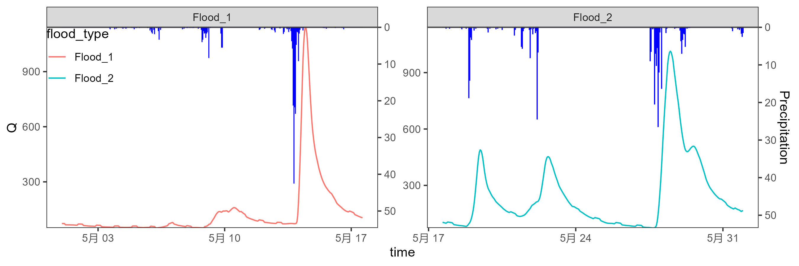
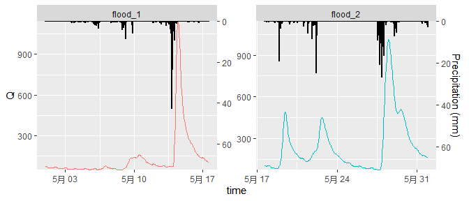
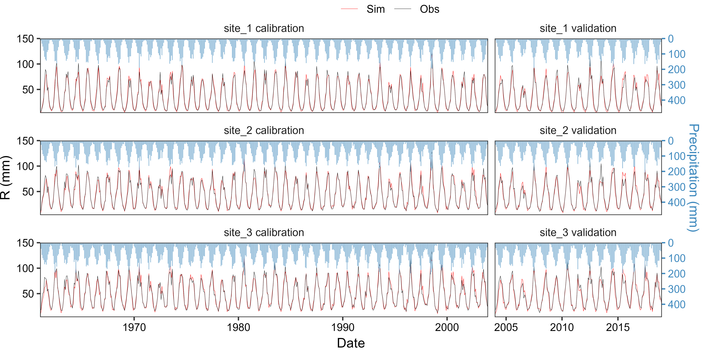

<!-- README.md is generated from README.Rmd. Please edit that file -->

# ggRunoff <a href="https://github.com/cug-xyx/ggRunoff"></a>

<!-- badges: start -->

[](https://www.gnu.org/licenses/gpl-3.0)

<!-- badges: end -->

## Overview

`ggRunoff` is an R package that can use the `ggplot2` syntax to help you
visualise **rainfall-runoff process lines** through the simplest
functions in R language:

- `geom_rainfallRunoff()` adds rainfall-runoff process line layer
- `scale_y_precipitation()` adjusts y-axis and second axis

\| 洪水过程线 \| 流量过程线 \|

## Installation

You can install the development version of `ggRunoff` from
[GitHub](https://github.com/) with:

``` r
# install.packages("remotes") or using `devtools`
remotes::install_github("cug-xyx/ggRunoff")
```

## Usage

### Rainfall-runoff process lines

Firstly, load `ggRunoff` package and `runoff_data`.

``` r
library(ggRunoff)

data("runoff_data", package = "ggRunoff")

# add a flood type
runoff_data$flood_type = c(rep('flood_1', 400), rep('flood_2', 344))
```

Check `runoff_data`.

``` r
tibble::tibble(runoff_data)
#> # A tibble: 744 x 4
#>   time                 prcp     Q flood_type
#>   <dttm>              <dbl> <dbl> <chr>     
#> 1 2010-05-01 00:00:00     0  73.3 flood_1   
#> 2 2010-05-01 01:00:00     0  72.8 flood_1   
#> 3 2010-05-01 02:00:00     0  72.9 flood_1   
#> 4 2010-05-01 03:00:00     0  73.3 flood_1   
#> 5 2010-05-01 04:00:00     0  69.8 flood_1   
#> # ... with 739 more rows
```

Draw rainfall-runoff process lines. Note that the parameter `coef` is a
factor that **adjusts the scale of rainfall and runoff**. It is used in
the `geom_rainfallRunoff` function to **adjust the scale of the two on
the graph**, and in the `scale_y_precipitation` function to **adjust the
magnitude of the second coordinate axis**.

``` r
set_coef = 15

ggplot(runoff_data, aes(x=time, Q)) +
  geom_rainfallRunoff(
    aes(runoff=Q, prcp=prcp, color=flood_type), 
    coef=set_coef, show.legend = F
  ) +
  scale_y_precipitation(sec.name = 'Precipitation (mm)', coef = set_coef) +
  facet_wrap(~flood_type, scales = 'free')
```



## More examples produced by `ggRunoff`

Optimising results in [Usage](#Usage). [Click
here](inst/scripts/demo-ggRunoff.R) to see the source code.

<a href="inst/scripts/demo-ggRunoff.R"></a>

Visualisation of hydrological model performance during **calibration**
and **validation** periods at three sites by
[mnxuao](https://github.com/mnxuao). [Click
here](inst/scripts/demo-ggRunoff.R) to see the source code.

<a href="https://github.com/cug-xyx/ggRunoff/inst/figures/20230804-Renmx.jpg"></a>

## TODO

- [ ] Add a package logo using `hexSticker` or something.
- [ ] Add a setting for showing rainfall legend.
- [ ] Calculate `yint` by group for `facet_wrap` or `facet_grid`.
- [ ] `theme_rainfallRunoff`, including `aixs.line.y.right` and other
  theme. settings.
