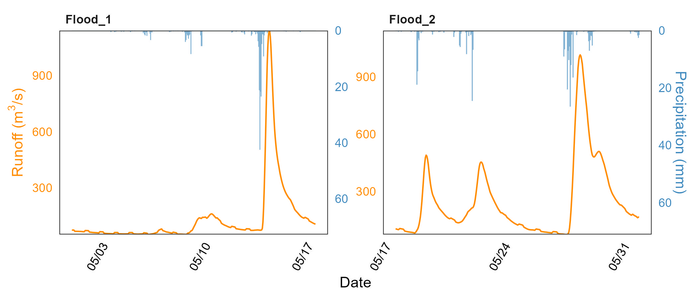

ggRunoff
================
Yuxuan Xie
2023/7/1

## Installation

You can install the development version of `ggRunoff` from
[GitHub](https://github.com/) with:

``` r
# install.packages("remotes")
remotes::install_github("cug-xyx/ggRunoff")
```

## Example

### Rainfall-runoff process lines

Firstly, load `ggRunoff` package and `runoff_data`.

``` r
library(ggRunoff)

data("runoff_data", package = "ggRunoff")

# add a flood type
runoff_data$flood_type = c(rep('flood_1', 400), rep('flood_2', 344))
```

Check `runoff_data`.

``` r
tibble::tibble(runoff_data)
#> # A tibble: 744 x 4
#>    time                 prcp     Q flood_type
#>    <dttm>              <dbl> <dbl> <chr>     
#>  1 2010-05-01 00:00:00     0  73.3 flood_1   
#>  2 2010-05-01 01:00:00     0  72.8 flood_1   
#>  3 2010-05-01 02:00:00     0  72.9 flood_1   
#>  4 2010-05-01 03:00:00     0  73.3 flood_1   
#>  5 2010-05-01 04:00:00     0  69.8 flood_1   
#>  6 2010-05-01 05:00:00     0  66.2 flood_1   
#>  7 2010-05-01 06:00:00     0  66.3 flood_1   
#>  8 2010-05-01 07:00:00     0  66.3 flood_1   
#>  9 2010-05-01 08:00:00     0  66.2 flood_1   
#> 10 2010-05-01 09:00:00     0  66.1 flood_1   
#> # ... with 734 more rows
```

Draw rainfall-runoff process lines. Note that the parameter `coef` is a
factor that **adjusts the scale of rainfall and runoff**. It is used in
the `geom_rainfallRunoff` function to **adjust the scale of the two on
the graph**, and in the `scale_y_precipitation` function to **adjust the
magnitude of the second coordinate axis**.

``` r
ggplot(runoff_data, aes(x=time, Q)) + theme_test() +
  geom_rainfallRunoff(
    aes(runoff=Q, prcp=prcp, color=flood_type), coef=15,
    rainfall.color='#80b1d3', rainfall.fill = '#80b1d3',
    color = 'darkorange', linewidth=0.5
  ) +
  scale_y_precipitation(sec.name = 'Precipitation (mm)', coef = 15) +
  facet_wrap(~flood_type, scales = 'free') +
  scale_x_datetime(date_labels = "%m/%d") +
  theme(
    legend.position = c(0, 1),
    legend.justification = c(0, 1),
    legend.background = element_blank(),
    legend.key = element_blank(),
    axis.ticks = element_blank(),
    axis.text.y.left = element_text(color='darkorange'),
    axis.text.y.right = element_text(color='#3e89be'),
    axis.text = element_text(color = 'black'),
    axis.text.x = element_text(angle = 60, hjust = 1),
    axis.title.y.left = element_text(color = 'darkorange'),
    axis.title.y.right =element_text(color = '#3e89be'),
    strip.background = element_blank(),
    strip.text = element_text(face = 'bold', hjust = 0)
  ) +
  labs(x = 'Date', y = expression('Runoff (m'^'3'*'/s)'))
```

<figure>

<figcaption aria-hidden="true">geom_rainfallRunoff</figcaption>
</figure>

## TODO

- [ ] calculate `yint` by group for `facet_wrap` or `facet_grid`

- [ ] automatically calculate `coef`

- [ ] `theme_runoff_prcp`, including `aixs.line.y.right` and other theme
  settings.

- [ ] reconfiguration `facet_subgraphs()`
